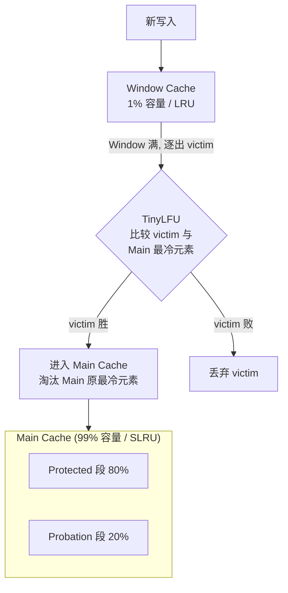

## 背景

缓存淘汰算法决定**当缓存满时该踢谁**。一个理想的淘汰算法需要同时满足：

1. **高命中率**：尽量保留未来会被访问的数据
2. **低内存开销**：淘汰算法自身的元数据不能太占内存
3. **时间/空间适应性**：能应对访问模式随时间变化

## LFU（Least Frequently Used）

记录每个元素的访问频率，淘汰频率最低的。

优点：
- 对热点数据友好：高频数据不容易被淘汰

缺点：
- **新元素冷启动**：刚加入的元素频率很低，还没积累就被踢了
- **历史包袱**：曾经高频但现在已经冷的数据占据缓存，很难被淘汰
- 频率计数器占用内存大（每个 key 都要记录精确计数）

## LRU（Least Recently Used）

按最近访问时间排序，淘汰最久没访问的。

优点：
- 实现简单（双向链表 + 哈希表）
- 对突发流量友好

缺点：
- **扫描污染**：一次全表扫描会把整个缓存洗成新数据，真正热数据被挤出
- **频率盲区**：只关心时间，不关心访问频率，一次访问和一百次访问在 LRU 里权重相同

## SLRU（Segmented LRU）

将缓存分成两段：**试用段（probation）** 和 **保护段（protected）**。

- 新元素先进入试用段
- 在试用段内被再次访问，晋升到保护段
- 淘汰从试用段发生

优点：
- 用"二次机会"解决 LRU 的扫描污染问题

缺点：
- 依然是纯 LRU 思想，不感知频率——保护段满时元素降级回试用段而非直接淘汰，但一个被访过 100 次却在试用段的元素仍可能先被踢

## CountMinSketch（近似计数器）

精确记录每个 key 的访问频率代价太高。Count-Min Sketch 用**概率换空间**：

- 维护一个 `d × w` 的二维计数器矩阵
- 每个元素经过 d 个哈希函数映射到每行的某个位置，计数器 +1
- 查询时取 d 个位置的最小值作为估计频率

特点：
- 只会**高估**不会低估（保证 No False Negative）
- 内存固定，与缓存元素数量无关
- 支持周期性衰减（除以 2），让历史数据随时间自然消退

## TinyLFU

TinyLFU 是 W-TinyLFU 的核心组件。它的思想：**用一个轻量级频率估计器替代精确计数**。

结构：

```
TinyLFU = CountMinSketch（近似频率统计） + 周期性衰减
```

淘汰策略：
- 当一个新元素想进缓存，比较新元素的频率估计和当前缓存中最"冷"元素的频率估计
- 新元素频率更高 → 踢掉冷的，放入新的
- 旧的频率更高 → 丢掉新的

解决的问题：
- 用极低内存获得近似频率信息
- 周期性衰减避免历史包袱

遗留的问题：
- 新元素的频率天然低，即使未来是热数据，也会被拒之门外（冷启动问题）

## W-TinyLFU

W-TinyLFU 在 TinyLFU 前面加了一个 **Window Cache（窗口缓存）**，专门解决冷启动问题。

### 整体架构




- **Window Cache**：占总容量 1%，使用纯 LRU 策略。新元素先进入这里，获得"起步频率"。
- **Main Cache**：占总容量 99%，使用 SLRU 策略（20% probation + 80% protected）。
- **TinyLFU**：作为"守门人"，在 Window → Main 淘汰时做决策。

### 淘汰流程

1. 新元素写入 Window Cache
2. Window Cache 满后，最冷的元素（Window LRU victim）尝试进入 Main Cache
3. TinyLFU 比较 Window victim 和 Main probation 段中最冷的元素
4. 频率更高者留下，另一个被淘汰

### 为什么 Window 只需 1%

Window 的目的不是缓存数据，而是**让新元素有机会积累几次访问**。大部分新元素在这一关中就会被自然淘汰（LRU），只有表现出一定热度的才有资格挑战 Main Cache。

### Caffeine 中的实际表现

Caffeine 是 Java 生态中最流行的本地缓存库，W-TinyLFU 是其默认淘汰策略。Benchmark 表明：

- 命中率接近**理想最优**（Belady's OPT）
- 内存开销极低（CountMinSketch 只需要几 KB）
- 对扫描、热点漂移等场景都有良好适应性

## 对比总结

| 算法 | 新元素友好 | 抗扫描 | 内存开销 | 命中率 |
|------|-----------|--------|---------|--------|
| LRU | 好 | 差 | 低 | 中 |
| LFU | 差 | 好 | 高 | 中 |
| SLRU | 好 | 中 | 低 | 中 |
| W-TinyLFU | 好 | 好 | 低 | 高 |
