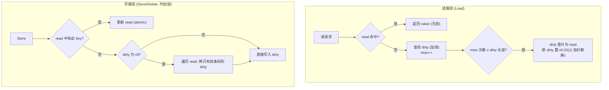

## 核心原理

sync.Map 适用于**读多写少**场景，通过读写分离提升性能：

- **读写分离**：内部维护只读字典（read）和读写字典（dirty）。读操作优先访问 read，miss 时才查 dirty。
- **延迟写入**：写操作只更新 dirty，不立即同步到 read。只有 misses 计数器超阈值时才将 dirty 同步到 read。
- **原子操作**：读操作大部分无锁（`atomic.Value`），写操作用 `sync.Mutex` 保护。

## vs 手动加锁 map

| 维度 | sync.Map | 手动加锁 map |
|---|---|---|
| 并发性能 | 读操作无锁，写操作延迟同步 | 读写互斥，高并发下性能差 |
| 适用场景 | 读多写少 | 读写均衡 |
| 实现复杂度 | 内置封装 | 自行管理锁 |

**结论**：读多写少场景用 sync.Map；简单场景手动加锁完全够用。
