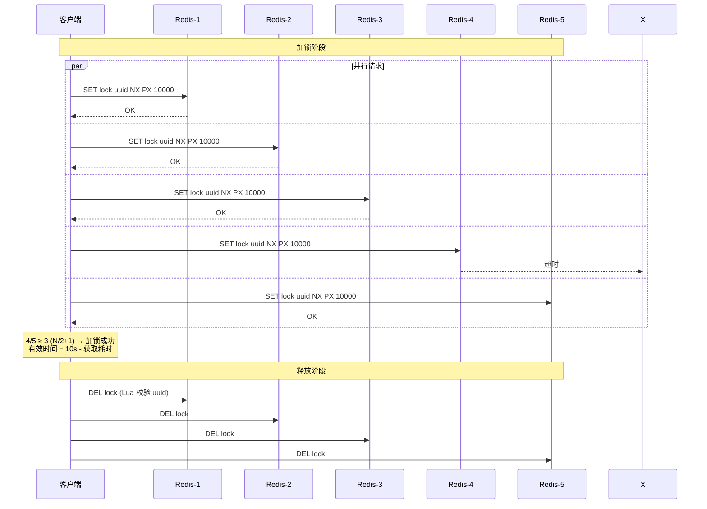

## 什么是 RedLock

RedLock 是 Redis 作者 Antirez 提出的分布式锁算法，使用多个独立 Redis 实例避免单点故障。

## 算法流程

1. 客户端向 N 个 Redis 实例（建议 N=5）尝试获取锁，生成随机锁 ID 并使用 `SET key value NX PX timeout`
2. 设定锁过期时间，防止死锁
3. 在大多数实例（N/2+1）上成功获取锁，才算获取成功
4. 锁有效时间 = 原始过期时间 - 获取锁耗时
5. 释放锁时向所有实例发送释放命令

## 优点

- 容错性：部分实例不可用，只要满足多数规则仍可正常工作
- 无中心化：不依赖单个锁服务

## 注意事项

- 需要与多个 Redis 实例通信，延迟高于单实例锁
- 安全性部分依赖实例间时间同步，时钟偏差可能影响安全性

参考：<https://cloud.tencent.com/developer/article/2390644>
