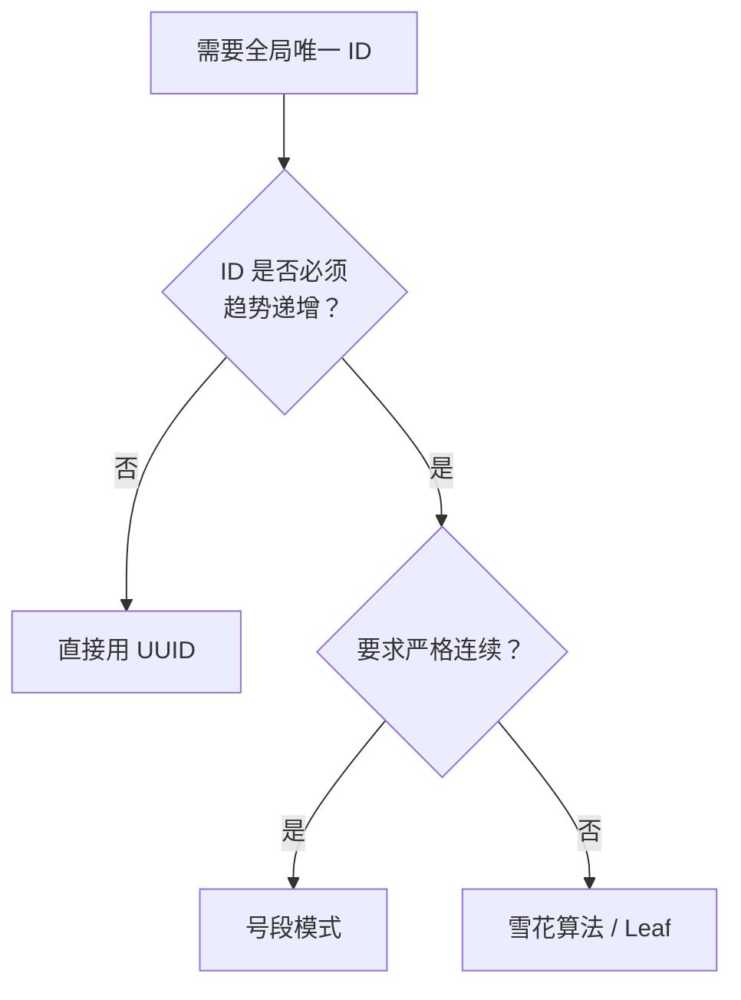

## 一句话定义

**分布式 ID** 就是在分库分表、微服务这些场景下，各节点不靠单库自增，自己生成**全局唯一、趋势递增**的 ID。

---

## 为什么需要它

单机时代，MySQL 自增主键 `AUTO_INCREMENT` 足够。到了分布式场景：

- **分库分表**：多个库各自自增，ID 必然冲突。
- **微服务**：用户服务、订单服务各自独立部署，不能共享一个 `auto_increment`。

所以得自己搞一套 ID 生成机制，不依赖单库自增。

**先记住三句话**：

1. **全局唯一是底线，趋势递增是加分项。** 唯一性不满足直接炸；不趋势递增只是索引性能差，不会出错。
2. **雪花算法去中心化但怕时钟回拨，号段模式性能好但依赖 DB。** 没有银弹，只有权衡。
3. **生产环境优先用现成的轮子。** 美团 Leaf、百度 UIDGenerator 都比自己手写靠谱。

---

## 方案概览

| 方案 | 全局唯一 | 趋势递增 | 纯数字 | 依赖外部 |
|------|---------|---------|--------|---------|
| UUID | Y | 无序 | N | 无 |
| 数据库自增 | Y | Y | Y | DB |
| 号段模式 | Y | Y | Y | DB（低频） |
| 雪花算法 | Y | Y | Y | 无 |
| Redis 自增 | Y | Y | Y | Redis |

---

## UUID：最简单的方案

```go
import "github.com/google/uuid"

id := uuid.New().String() // 550e8400-e29b-41d4-a716-446655440000
```

**一句话：** UUID 随手生成、几乎不可能冲突，但有两个致命伤——**字符串太长**（128 位，存成字符串 36 字节）且**完全无序**，做 MySQL InnoDB 主键时页分裂非常严重。

> 如果你用 UUID v7（时间戳前缀版本），可以兼顾全局唯一和时间有序，Go 的 `google/uuid` 库已支持。

---

## 数据库自增：最原始的思路

```sql
CREATE TABLE id_generator (
    id BIGINT AUTO_INCREMENT PRIMARY KEY
) ENGINE=InnoDB;
```

每次插入一条记录，拿到自增 ID 后再删除旧行，避免表无限膨胀。

**缺点很明显：** 每次取 ID 都要走一次 DB，高并发扛不住，QPS 被单库卡死。

---

## 号段模式：数据库自增的升级版

**核心思路：** 一次从 DB 取一段 ID（如 1000 个），缓存在内存中批量分配，用完再取下一段。

```go
type Segment struct {
    mu    sync.Mutex
    start int64 // 当前号段起始
    end   int64 // 当前号段结束
    cur   int64 // 当前已分配到
    step  int64 // 每次取的号段长度
}

func (s *Segment) Next() (int64, error) {
    s.mu.Lock()
    defer s.mu.Unlock()

    if s.cur >= s.end {
        // 号段耗尽，向 DB 申请下一个号段
        if err := s.fetchNextSegment(); err != nil {
            return 0, err
        }
    }
    s.cur++
    return s.cur, nil
}
```

```sql
-- 原子获取下一段：UPDATE 后直接用 LAST_INSERT_ID 取回更新后的值
UPDATE id_segment SET max_id = LAST_INSERT_ID(max_id + step) WHERE biz_type = 'order';
SELECT LAST_INSERT_ID();
```

**关键细节：**
- `step` 太小，频繁访问 DB；太大，服务重启浪费 ID。
- 多节点部署时，号和号之间有间隔，**ID 趋势递增但不是严格连续**。
- 美团开源的 [Leaf](https://github.com/Meituan-Dianping/Leaf) 就是这种方案的工业级实现。

---

## 雪花算法：去中心化的标配

Twitter 开源的 **Snowflake** 算法，用一个 64 位 `int64` 表示分布式 ID，结构如下：

```
┌─┬──────────────────────────────────────────┬──────────┬────────────┐
│0│             41 bit 时间戳 (ms)            │ 10 bit   │  12 bit     │
│ │         (从自定义起始时间算起)              │ 机器编号  │ 序列号      │
└─┴──────────────────────────────────────────┴──────────┴────────────┘
```

- **41 bit 时间戳**：毫秒级，可用约 69 年。
- **10 bit 机器编号**：支持 1024 个节点。
- **12 bit 序列号**：同一毫秒内最多生成 4096 个 ID。

```go
type Snowflake struct {
    mu       sync.Mutex
    epoch    int64 // 自定义起始时间戳，如 2024-01-01 00:00:00 UTC
    workerID int64 // 机器编号 (0~1023)
    sequence int64 // 当前毫秒内的序列号
    lastMs   int64 // 上一次生成 ID 的时间戳
}

const (
    workerBits     = 10
    sequenceBits   = 12
    workerShift    = sequenceBits
    timestampShift = workerBits + sequenceBits
    sequenceMask   = -1 ^ (-1 << sequenceBits)
)

func (s *Snowflake) Next() (int64, error) {
    s.mu.Lock()
    defer s.mu.Unlock()

    now := time.Now().UnixMilli()
    if now < s.lastMs {
        // 时钟回拨——雪花算法最头疼的问题
        return 0, errors.New("clock moved backwards")
    }

    if now == s.lastMs {
        s.sequence = (s.sequence + 1) & sequenceMask
        if s.sequence == 0 {
            // 当前毫秒序列号用完，等到下一毫秒
            for now <= s.lastMs {
                now = time.Now().UnixMilli()
            }
        }
    } else {
        s.sequence = 0
    }

    s.lastMs = now
    return (now-s.epoch)<<timestampShift |
        s.workerID<<workerShift |
        s.sequence, nil
}
```

### 时钟回拨怎么办

雪花算法最大的坑是**机器时钟回拨**（NTP 校时、虚拟机迁移都可能导致）。应对策略：

| 策略 | 说明 |
|------|------|
| 短时等待 | 回拨几毫秒时，等时钟追上再继续生成（上面代码的做法） |
| 启用备用 workerID | 检测到回拨，自动换一个 workerID 继续生成 |
| 号段兜底 | 回拨期间切到号段模式生成 ID，时钟恢复后切回 |
| 直接报错 | 最保守的做法，宁可失败也不生成重复 ID |

---

## 号段 + 雪花混合

美团 Leaf 把两种方案整合在一起：号段模式负责连续性要求高的场景，雪花模式负责去中心化场景，workerID 通过 ZooKeeper 自动注册分配。

---

## 怎么选



---

## 常见误区

1. **拿时间戳直接当 ID。** 同一毫秒内并发请求的时间戳会重复，不唯一。时间戳只能做雪花算法的组成部分，不能独立用。
2. **雪花算法不设 workerID 或所有节点用同一个 workerID。** 同一毫秒内不同节点的序列号从 0 开始，不同节点可能生成完全相同的 ID。
3. **号段模式的 `step` 设得过大。** 服务重启一次浪费大量 ID。建议 `step` 够用一两分钟就行，不用贪多。
4. **以为 UUID 做 InnoDB 主键没问题。** UUID v4 完全随机，插入时页分裂严重，B+ 树频繁 rebalance，写入性能会很差。要么用 UUID v7，要么主键用自增数字、UUID 只做业务键。
5. **忽略了 ID 长度对前端的影响。** JavaScript 的 `Number` 安全整数范围是 `±2^53-1`，雪花算法的 64 位 ID 可能溢出，前端拿 ID 记得用字符串。
